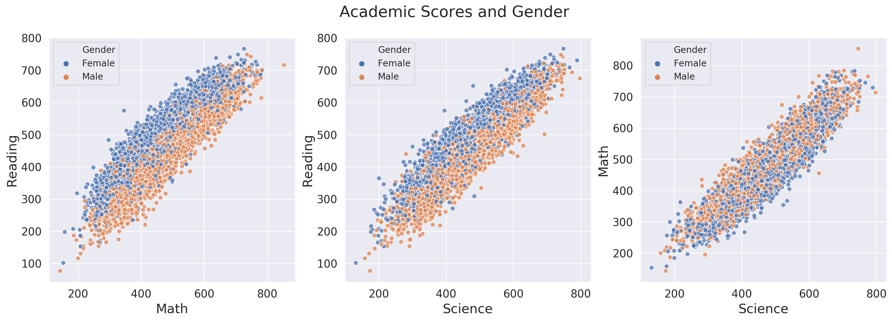
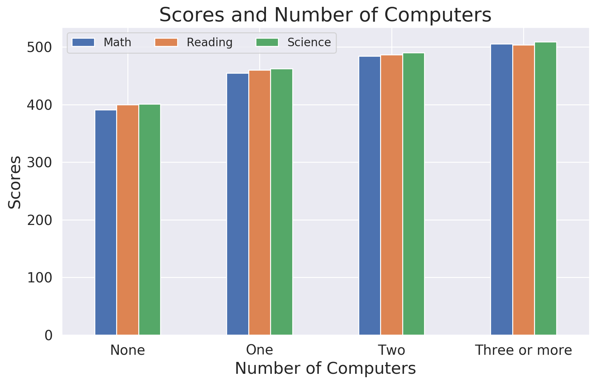
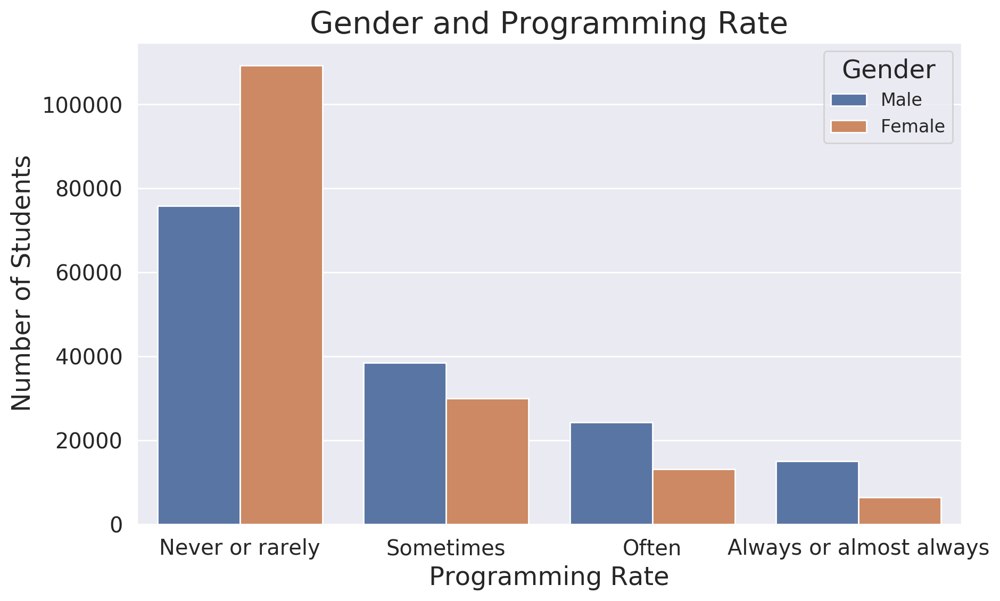

# PISA 2012 Dataset Exploration
## by Vyacheslav Yamont

## Dataset

This project explores The Programme for International Student Assessment (PISA) 2012 Dataset. PISA is a survey of students' skills and knowledge as they approach the end of compulsory education. It is not a conventional school test. Rather than examining how well students have learned the school curriculum, it looks at how well prepared they are for life beyond school.

## Summary of Findings

* Subject scores have normal distribution
* Wealth distribution has a slight skew to the left with several outliers at the high side
* Mexico, Italy, and Spain provided the largest amount of students
* Families with no computer are rare
* It's popular to have more than 2 computers per family
* The number of students who use programming is far less than those who doesn't use it
* Successful students in common are successful in all subjects simultaneously
* Wealth index has a very low impact on academic performance
* Male students have slightly higher math and science scores on average
* Female students have slightly higher reading scores on average
* The Number of computers has a high correlation with academic performance and wealth index
* Male students like programming more than female students
* Singapore is a leader by number of outperforming students in every subject
* There is a small positive correlation between wealth index and programming rate
* Australia and Canada have higher number of wealthy students than the USA

## Key Insights for Presentation

---

---

---

---

---

